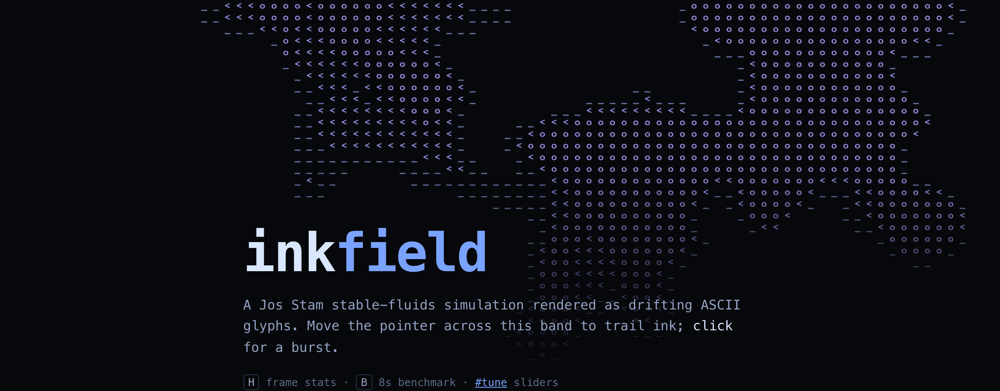

# inkfield

A Jos Stam stable-fluids simulation rendered as drifting ASCII glyphs. Drop it behind a
page as a background effect: no dependencies, no build step, WebGL2 with a Canvas2D
fallback, 13 kB packed.

[](https://mdourmouch.github.io/inkfield/)

**[Try it](https://mdourmouch.github.io/inkfield/)** — that page is the repo's `index.html`,
one self-contained file with the library pasted in, so it also opens by double-click after
a clone.

Every frame solves incompressible fluid motion on a grid (advect, project, damp), then
maps each cell to one of four glyphs (`' ' _ < o`) by density plus velocity magnitude.
Ink is pushed by the pointer, dissipates as it spreads, and shifts hue with intensity.
The result reads as smoke or ink in water, drawn in text.

## Install

```sh
npm install inkfield
```

Or skip the install. It is plain ESM, so a CDN works as-is:

```html
<script type="module">
  import { createInkfield } from 'https://esm.sh/inkfield';
  createInkfield();
</script>
```

## Use

`createInkfield()` with no arguments appends its own canvas as a fixed, full-viewport,
click-through background and starts running.

```js
import { createInkfield } from 'inkfield';

const ink = createInkfield({ baseHue: 210, background: '#07080b' });
// later
ink.destroy();
```

> **The canvas sits at `z-index: -1`.** A background painted on `<body>` will cover it.
> Move the page colour to `html`, or pass your own canvas and place it yourself.

### React / Next.js

```jsx
// app/layout.jsx — works under `output: 'export'`; the component is already 'use client'
import { Inkfield } from 'inkfield/react';

export default function RootLayout({ children }) {
  return (
    <html lang="en">
      <body>
        <Inkfield baseHue={210} />
        {children}
      </body>
    </html>
  );
}
```

Pass a `className` (or a `style`) and the fixed-background default is dropped, so the
canvas is laid out by your stylesheet. That is how you scope the effect to a banner that
scrolls with the page rather than sitting behind the whole viewport:

```jsx
<header className="hero">          {/* position: relative */}
  <Inkfield className="hero-ink" background={null} />
  <h1>…</h1>                       {/* position: relative, so it paints on top */}
</header>
```

```css
.hero-ink {
  position: absolute; inset: 0; width: 100%; height: 100%;
  pointer-events: none;
  mask-image: linear-gradient(to bottom, #000 55%, transparent);
}
```

Ink is only injected while the pointer is inside the canvas box, so the effect stops
taking input once you scroll past the banner.

Props are read once, on mount — changing one later does not restart the effect, because
restarting throws the field away. To animate a parameter, mutate `handle.params` from a
`createInkfield` call of your own; the solver reads it live.

Verified against Next 16 with Turbopack and `output: 'export'`, with no
`transpilePackages` entry needed. If an older bundler objects to untranspiled ESM in
`node_modules`, add `transpilePackages: ['inkfield']` to `next.config.js`.

### Your own canvas

Pass one and inkfield leaves styling and placement to you. Size it with CSS. inkfield
writes only the backing store, and a `ResizeObserver` keeps the simulation grid matched to
the canvas box, whether that box is the full viewport or a card in a layout.

```js
createInkfield({ canvas: document.querySelector('#bg'), background: null });
```

## Options

Every key in [`defaults`](src/inkfield.js) can be passed inline, plus:

| | |
|---|---|
| `canvas` | Draw into this canvas instead of creating one. |
| `container` | Parent for a created canvas. Default `document.body`. |
| `renderer` | `'auto'` (default), `'webgl2'`, `'canvas2d'`. |
| `background` | Any CSS colour, or `null` for a transparent canvas. Default `'#07080b'`. |
| `glyphs` | Density ramp, faintest first. The first glyph is never drawn. Default `' _<o'`. |
| `fontFamily` | Default `'monospace'`. |
| `maxDpr` | Pixel-density cap. Default `2`. |
| `zIndex` | For a created canvas. Default `-1`. |
| `reducedMotion` | `'respect'` (default) or `'ignore'`. |
| `onFrame` | `(stats) => void`, every frame. Timings, grid size, cells drawn. |

`defaults` lists the sim parameters: `cellSize`, `dt`, `dissipation`, `velocityDamping`,
`baseHue`, `hueShift`, `mouseRadius`, `clickForce` and the rest. They live on `ink.params`.
Mutate one and the next frame uses it. After `cellSize`, call `ink.resize()`.

## Handle

```js
ink.params            // live, mutable
ink.stats             // last frame's timings and counts
ink.renderer          // 'webgl2' | 'canvas2d'
ink.inject(x, y, { radius, density, fx, fy })   // push ink, CSS px from the canvas corner
ink.burst(x, y, { radius, density, force })     // radial burst
ink.start() / ink.stop() / ink.running
ink.resize()
ink.destroy()
```

`destroy()` is required on unmount. React strict mode mounts twice, and two live rAF
loops is two simulations.

## Behaviour worth knowing

- **The field starts empty.** Nothing is drawn until the pointer moves or you call
  `inject`/`burst`. To get motion on an untouched page, drive it from a timer. The
  benchmark's stress pattern in `demo/index.html` is a working example.
- **A fast pointer draws nothing.** One `mouseDensity` dab lands below the first glyph
  step, so a cell only becomes visible once several frames hit it. Measured at the default
  `cellSize: 14`, a pointer moving 8 px per frame leaves a trail and one moving 14 px per
  frame leaves none. Raise `mouseDensity` if quick sweeps should register.
- **`prefers-reduced-motion` stops the loop** and paints the background only. Pass
  `reducedMotion: 'ignore'` to override.
- **Backgrounded tabs cost nothing.** `requestAnimationFrame` does not fire there.
- **A lost WebGL context recovers.** Sleep or a GPU reset drops the context; inkfield
  catches that and rebuilds on restore, rather than leaving a canvas blank for good.
- **Pointer listeners are on `window`**, since a background canvas is `pointer-events:
  none` and never receives the events itself.

## Development

| | |
|---|---|
| `npm test` | Renderer wiring, input, dissipation and teardown, on a DOM stub. |
| `npm run bench` | Asserts the shipped solver stays bit-identical to the reference, and times both. |
| `npm run demo` | Serves the repo on :8080. `/` is the built page, `/demo/` the source one. |
| `npm run demo:build` | Rebuilds `index.html` after a change to `src/` or `demo/index.html`. |

`demo/index.html` is the source page and imports from `src/`, so it needs a server:
browsers block ES module fetches over `file://`. `demo/build.mjs` pastes the library into
it to produce the root `index.html`, which is what GitHub Pages serves and what opens by
double-click. `npm test` regenerates that file and fails if it has drifted, so the two
cannot diverge.

`examples/nextjs/` is the same page as a Next.js app, for the React integration.

The playground takes URL flags: `#tune` Tweakpane controls · `#bench` autostart the 8s
stress benchmark · `#2d` force Canvas2D · `#dpr1` force 1x pixel density. Combine them in
one hash (`#2d-bench`). **B** runs the benchmark, **H** toggles the HUD.

`bench/legacy-canvas2d.html` is the original unoptimised Canvas2D build, kept as the A/B
control for the glyph-atlas and instancing work.

## License

MIT
